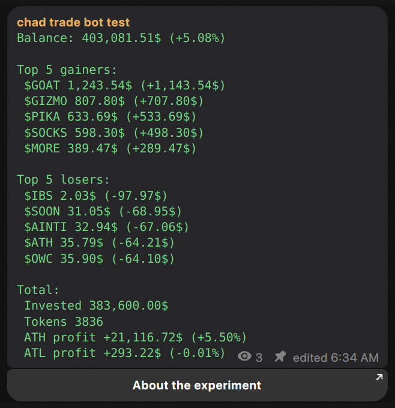

# Crypto portfolio tracker



## Getting started

### Requirements

- Python 3.10
- Docker, Docker-compose (if you want run via docker)
- [CoinGecko API key](https://docs.coingecko.com/v3.0.1/reference/setting-up-your-api-key)
- Telegram bot token with channel admin rights

### How to run

#### 1. Install dependencies

```bash
pip install -r src/requirements.txt
```

#### 2. Prepare .env file

- Create `.env` file in root dir
- Paste from `.env.example` into `.env`

```bash
DATABASE_PATH=90c3a95f43fa187c6e7a9d2ff319e5ae05ff77f4.db

# don't edit portfolio id
CONFIG_PORTFOLIO_ID=
CONFIG_CURRENCY=usd
CONFIG_BUY_AMOUNT=100
CONFIG_MIN_MCAP=1000000
CONFIG_MARKET_DATA_UPDATE_INTERVAL=600
CONFIG_TELEGRAM_MESSAGE_UPDATE_INTERVAL=600

TELEGRAM_BOT_TOKEN=
TELEGRAM_CHANNEL_ID=1999073244
TELEGRAM_CHANNEL_MESSAGE_ID=

COINGECKO_API_KEY=
```

#### 3. Prepare database

```bash
cd src && python prepare.py
```

#### 4. Run

```bash
cd src
python main.py
```

#### 4. Run via Docker-compose

```bash
docker-compose -f docker-compose.yaml up -d
```

## Configuration

| Name                                     | `.env` var                              | Explanation                                                                              |
| ---------------------------------------- | --------------------------------------- | ---------------------------------------------------------------------------------------- |
| Portfolio id                             | CONFIG_PORTFOLIO_ID                     | Internal portfolio id in database. Don't touch                                           |
| Currency                                 | CONFIG_CURRENCY                         | Quote currency for [CoinGecko API](https://docs.coingecko.com/v3.0.1/reference/coins-id) |
| Buy amount                               | CONFIG_BUY_AMOUNT                       | Asset quote buy amount (in CONFIG_CURRENCY)                                              |
| Minimal market cap                       | CONFIG_MIN_MCAP                         | Minimal market cap to buy for asset                                                      |
| Market data update interval              | CONFIG_MARKET_DATA_UPDATE_INTERVAL      | Interval for CoinGecko assets update task                                                |
| Telegram channel message update interval | CONFIG_TELEGRAM_MESSAGE_UPDATE_INTERVAL | Interval for channel message update task                                                 |
